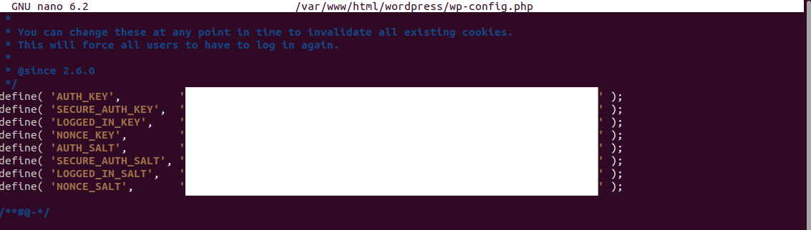

# IAW 6.2. (HARDENING WORDPRESS)
En este documento Markdown, se recoge la realización de la tarea 6.2. del módulo de Implantación de Aplicaciones Web (IAW)

A lo largo de este documento, se explicarán diversas formas de implementar mejoras en los procesos de seguridad de un Wordpress que hemos creado y subido previamente
Es necesario tener en cuenta que este Wordpress primero se ha configurado en local, y posteriormente le hemos asignado un dominio y hecho público a través de Infinityfree

La web en cuestión es [CyberCast](https://cybercast.42web.io/), un sitio web convertido en Blog sobre ciberseguridad creado como sitio para testing. En esta ocasión, se ha trabajado con una máquina con Ubuntu 22.04 LTS. *Debido a las restricciones del servidor gratuito de InfinityFree, es posible que al intentar acceder al enlace anterior resulte necesario refrescar la página para que podamos visualizar correctamente la web*


## ¿Qué se nos pide exactamente para esta tarea?
Para completar esta actividad, necesitaremos:
1. Este mismo documento, en formato Markdown
2. Dentro de este documento, la descripción y captura de pantalla de cada uno de los pasos realizados, orientado a mejorar la seguridad de nuestro Wordpress
3. El script en bash de automatización de acciones de seguridad, que se puede encontrar en este mismo respositorio

## Desarrollo de las cinco acciones para incrementar la seguridad en nuestro Wordpress

*No necesariamente tenemos por qué hacerlas en este orden*

### Acción 0: Pasos transversales
En cualquiera de los pasos, es necesario recordar que todos aquellos cambios que realicemos será recomendable actualizarlo en los archivos que tengamos subidos al hosting, o bien si trabajamos desde local, actualizando apache mediante el comando

```bash
sudo system restart apache2
```

### Acción 1: Deshabilitar la edición de archivos desde el panel
Para imposibilitar la edición de archivos desde el panel por parte de un atacante a través de modificación de código, será necesario que modifiquemos el archivo **wp-config.php** de nuestro Wordpress. En nuestro caso, podríamos editar el archivo .php directamente desde el File Manager de Infinityfree, pero también podemos modificarlo a través del terminal y luego actualizarlo entre los archivos subidos en el hosting añadiendo el siguiente código al archivo .php.

Para modificar el archivo **wp-config.php**

```bash
sudo nano /var/www/html/wp-config.php
```
La ruta es una ruta de ejemplo teniendo en cuenta la que suele ser habitual en sistemas como en este caso Ubuntu. Recordemos aplicar control O para guardar la modificación, y control X para salir de la edición nano.

```php
define('DISALLOW_FILE_EDIT', true);
```
Esta línea deberá ir antes de aquella que dice /* That's all, stop editing! Happy publishing. */
Podemos adjuntarla en el apartado de configuraciones personalizadas , justo antes de esta línea, de la siguiente forma


### Acción 2: Modificar los permisos de las carpetas o directorios y de los archivos
Resulta interesante que modifiquemos los permisos de lectura, escritura y ejecución, teniendo mayor control sobre ellos y restringiendo el acceso por parte de terceros
Es habitual emplear la regla de 755 para directorios/carpetas (rwxr-xr-x) y 644 para archivos(rw-r--r--). De forma resumida, esto significa lo siguiente:
- **El permiso 755** permite a otros usuarios leer y ejecutar, pero no redactar, cosa que sí puede seguir haciendo el propietario
- **El permiso 644** va un paso más allá del anterior, haciendo que otros usuarios sólo puedan leer el archivo

Podremos cambiar la configuración de permisos siguiendo esta estructura aplicando la siguiente sentencia de código en bash:

```bash
sudo find /var/www/html -type d -exec chmod 755 {} \;
sudo find /var/www/html -type f -exec chmod 644 {} \;
```
*find* accederá a la ruta donde se encuentren estos documentos y aplicará el permiso 755 a las carpetas/directorios *(-type d)* y el 644 a los archivos *(-type f)*
*d de directory* y *f de file*

Los cambios se aplicarán sin salida de una respuesta en terminal, como en la siguiente captura


### Acción 3: Configurar las claves de seguridad (SALT)
Las claves SALT nos ayudan a obtener una capa adicional de seguridad en datos cifrados, protegiendo el acceso de inicio de sesión del sitio web junto con sus cookies correspondientes.
Este paso puede hacerse de manera conjunta con la Acción 1, puesto que tendremos que retomar la modificación del archivo **wp-config.php**
Dentro del archivo, buscaremos la línea define('AUTH KEY', ...)
Wordpress posee una herramienta propia de creación de claves SALT, a través del siguiente enlace: 

[Enlace a generador de claves SALT](https://api.wordpress.org/secret-key/1.1/salt/)

Deberemos sustituir cada una de las claves asociadas a cada uno de los valores ('AUTH_KEY', 'SECURE_AUTH_KEY', 'NONCE_KEY', etc), y al igual que con cualquier otra contraseña, no deberíamos compartirla públicamente. Por ello, en la imagen que puede encontrarse a continuación, dentro del archivo de edición, se han tapado cada una de las claves.



### Acción 4: Bloquear la ejecución de código PHP en subdirectorios
El documento .htaccess bien empleado puede ayudarnos a restringir el acceso a atacantes que puedan crear y/o ejecutar código PHP malicioso dentro de nuestros subdirectorios. Dentro de nuestra carpeta wp-content, tendremos subdirectorios sensibles y vulnerables como pueden ser uploads, plugins, o themes, a través de los cuales podrían hacer daño a todo el sistema web
En cada uno de estos directorios, crearemos un nuevo documento .htaccess con el siguiente contenido para prevenir que esto suceda:

```
<Files *.php>
deny from all
</Files>
```

A continuación podemos ver el ejemplo de una de estas acciones, en este caso con el subdirectorio plugins:

[](images/accion4_1.png)

El comando 

```bash
echo -e "<Files *.php>\ndeny from all\n</Files>" | sudo tee /var/www/html/wp-content/plugins/.htaccess > /dev/null
```

Nos permite crear el contenido ya dentro del nuevo archivo .htaccess sin necesidad de crear y luego modificar de manera ordinaria. Además, añadiéndole el . inicial, lo convertimos en un archivo "invisible" dentro de nuestra carpeta, por lo que si luego queremos acceder será preferiblemente a través de línea de comandos
-e nos permite introducir el texto añadiendo saltos de página \n propios de código php
sudo tee ... > /dev/null guarda automáticamente el archivo con permisos asignados, y evita que aparezca la salida directamente en nuestra consola
Como se puede apreciar en la captura de pantalla, hemos aplicado ls -la para comprobar la creación del archivo, que efectivamente nos aparece entre los contenidos de la carpeta plugins
Si queremos comprobar que efectivamente el documento **.htaccess** está debidamente configurado, simplemente lo abriremos con el comando sudo nano + la ruta del archivo

[](images/accion4_2.png)

Repetiríamos este mismo proceso para todas las carpetas que nos interese, como se expuso anteriormente


### Acción 5: Desactivar el acceso a xmlrpc.php
En relación a lo anterior, otra medida similar podría ser el bloqueo del acceso al archivo xmlrpc.php, un blanco común para ataques por fuerza bruta y DDoS. Para ello, deberemos modificar de nuevo el archivo **.htaccess** pero esta vez refiriéndonos al archivo raíz, y además de *Deny from all*, añadiremos antes *Order Deny,Allow*. En esta ocasión, por cambiar respecto al caso anterior, lo haremos mediante comando sudo nano
El código a incorporar en nuestro documento sería:
```
<Files xmlrpc.php>
Order Deny,Allow
Deny from all
</Files>
```

[](images/accion5_1.png)

[](images/accion5_2.png)

Como puede apreciarse, la información que podemos apreciar en este archivo **.htaccess** es considerablemente diferente a la acción anterior, puesto que como se exponía, en este caso trabajaremos en el documento del archivo raíz, afectando a todos los demás. 